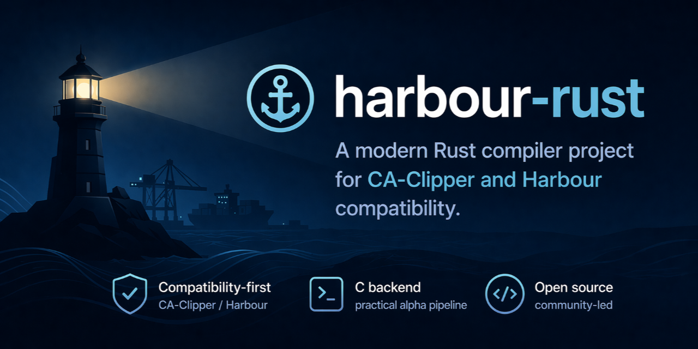

# Harbour Rust

[](https://github.com/arcostasi/harbour-rust/actions/workflows/quality.yml)
[](https://github.com/arcostasi/harbour-rust/actions/workflows/release.yml)
[](https://github.com/arcostasi/harbour-rust/releases)
[](./LICENSE)



Rust compiler project for CA-Clipper/Harbour compatibility, with a practical executable C backend, modern CLI, and long-term xBase modernization focus.

[English](./README.md) | [Português do Brasil](./README.pt-BR.md)

[Latest release](https://github.com/arcostasi/harbour-rust/releases/tag/0.5.0-alpha) | [All releases](https://github.com/arcostasi/harbour-rust/releases) | [Documentation](./docs/README.md) | [Contributing](./CONTRIBUTING.md)

Harbour Rust is an independent, community-led, open source compiler project written in Rust and designed for compatibility with CA-Clipper and Harbour.

This repository is maintained as a public, non-commercial contribution to the software community. It is not affiliated with, endorsed by, or sponsored by the Harbour Project, xHarbour, CA-Clipper, or any trademark owner related to those names. Those names are used only to describe compatibility goals and historical context.

The project also has a personal origin: xBase was the maintainer's first serious programming environment and played an important role in his path as a developer. That background motivates the work, but the repository is intended to remain technically rigorous, community-oriented, and professionally documented.

## Goals

- provide a modern Rust implementation for a historically important xBase language family;
- prioritize observable compatibility before internal elegance in early phases;
- keep the compiler architecture understandable, testable, and incrementally maintainable;
- build the project in public with documentation, tests, and governance fit for long-term collaboration.

## Current Status

The repository has completed phases 0 through 14 of its current roadmap and has packaged a first phase 15 compatibility expansion for the `0.5.0-alpha` release line.

Current highlights:

- parser, HIR, sema, runtime, IR, and the current executable C backend are implemented;
- procedural compatibility, arrays, `STATIC`, memvars, codeblocks, and selected advanced preprocessor markers are available;
- DBF/RDD groundwork is present;
- CLI, regression harnesses, benchmarks, fuzz scaffolding, release workflows, and cross-platform CI validation are in place.

## Releases

- Latest pre-release: [0.5.0-alpha](https://github.com/arcostasi/harbour-rust/releases/tag/0.5.0-alpha)
- All releases: [github.com/arcostasi/harbour-rust/releases](https://github.com/arcostasi/harbour-rust/releases)
- Latest pre-release assets:
  - [Linux x86_64](https://github.com/arcostasi/harbour-rust/releases/download/0.5.0-alpha/harbour-rust-cli-0.5.0-alpha-linux-x86_64.zip)
  - [macOS aarch64](https://github.com/arcostasi/harbour-rust/releases/download/0.5.0-alpha/harbour-rust-cli-0.5.0-alpha-macos-aarch64.zip)
  - [Windows x86_64](https://github.com/arcostasi/harbour-rust/releases/download/0.5.0-alpha/harbour-rust-cli-0.5.0-alpha-windows-x86_64.zip)
  - [SHA256SUMS.txt](https://github.com/arcostasi/harbour-rust/releases/download/0.5.0-alpha/SHA256SUMS.txt)
  - [benchmark-report.md](https://github.com/arcostasi/harbour-rust/releases/download/0.5.0-alpha/benchmark-report.md)

## Documentation

Start here:

- [Roadmap](./ROADMAP.md)
- [Compatibility](./COMPATIBILITY.md)
- [Contributing](./CONTRIBUTING.md)
- [Governance](./GOVERNANCE.md)
- [Security](./SECURITY.md)
- [Support](./SUPPORT.md)
- [Provenance and Copyright Policy](./PROVENANCE.md)
- [Documentation Center](./docs/README.md)

Technical guides:

- [Technical Overview](./docs/en/technical/overview.md)
- [Architecture](./docs/en/technical/architecture.md)
- [Runtime](./docs/en/technical/runtime.md)
- [CLI](./docs/en/technical/cli.md)
- [Test Strategy](./docs/en/technical/test-strategy.md)

## Quick Start

```text
cargo fmt --all
cargo clippy --workspace --all-targets --all-features -- -D warnings
cargo test --workspace
cargo run -p harbour-rust-cli -- help
```

## Open Source Positioning

Harbour Rust is:

- open source;
- community-oriented;
- non-commercial as a project initiative;
- independently maintained;
- intended as a respectful technical contribution to a classic ecosystem.

Contributions are welcome, but all submitted material must be original or lawfully reusable. See [PROVENANCE.md](./PROVENANCE.md) for the repository policy on originality, upstream references, translation, and third-party material.

## Community

- Use GitHub Issues for focused bugs, compatibility problems, and scoped work items.
- Use GitHub Discussions for questions, ideas, and broader design conversations when Discussions are enabled for the repository.
- Use pull requests for concrete, reviewable changes with tests and synchronized documentation updates.

The repository templates in `.github/` are designed to support English and Portuguese contributors without changing the canonical policy language of the project.

## License

This repository is distributed under the [Apache License 2.0](./LICENSE).
